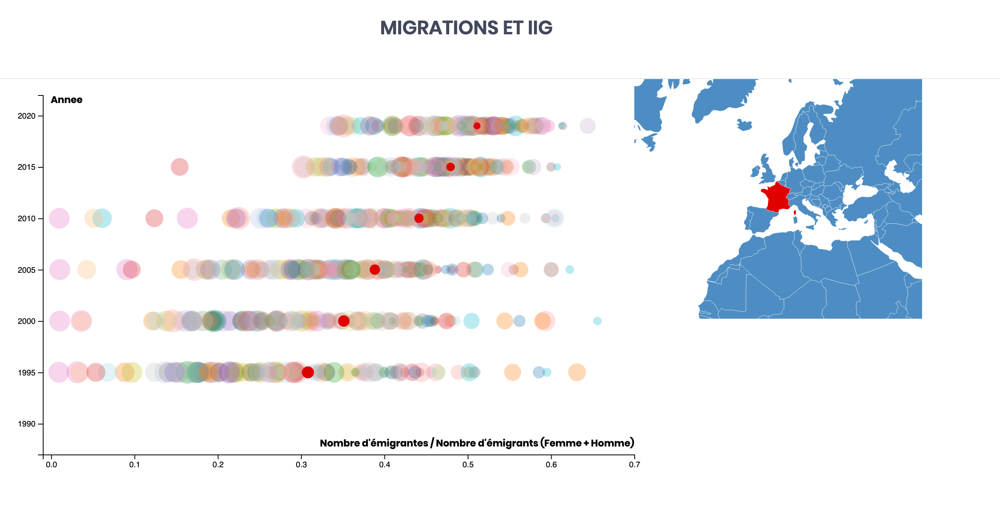

# [Migration Mondiale](https://s12p.github.io/DataVisualization/)

Le but de ce projet est de trouver des liaisons entre les migrations humaines et les différents facteurs du développement des societés. Pour cela, nous allons analyser tout d'abord les migrations au niveau général, puis nous regarderons l'évolution des migrations par pays par rapport à l'IDH (indice de développement humain), l'IIG (indice d'inégalité de genre) et le taux de chômage.

##

## Notre site

Nous modélisons les migrations des différents pays au cours des ans. Nous pouvons selectionner un pays et obtenir des informations suplémentaires comme le nombres d'immigrants des dix pays qui immigrent le plus dans ce pays.

Nous modélisons les migrations des différents pays au cours des ans en normalisant par rapport a la population de chaque pays. Nous pouvons selectionner un pays et obtenir des informations suplémentaires comme le nombres d'immigrants des dix pays qui immigrent le plus dans ce pays.

Nous affichons le nombre d'immigrants normalisé au cours des années avec la valeur d'indice de développement humain (idh) représenté par le rayon des cercles. En selectionnant un pays sur la carte, les valeurs concernant ce pays se demarquent sur le graphique.

Nous affichons le nombre d'émigrantes normalisé au cours des années avec la valeur d'indice d'inégalité de genre (iig) représenté par le rayon des cercles. En selectionnant un pays sur la carte, les valeurs concernant ce pays se demarquent sur le graphique.

Nous affichons le nombre d'émigrants normalisé au cours des années avec la valeur d'indice du chomage représenté par le rayon des cercles. En selectionnant un pays sur la carte, les valeurs concernant ce pays se demarquent sur le graphique.

# Source

* [http://hdr.undp.org/en/data](http://hdr.undp.org/en/data)
* [https://www.un.org/en/development/desa/population/migration/data/estimates2/estimates19.asp](https://www.un.org/en/development/desa/population/migration/data/estimates2/estimates19.asp)
